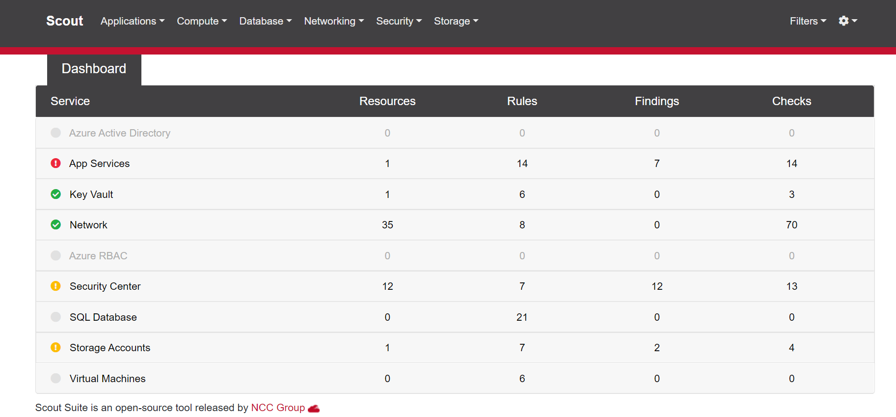
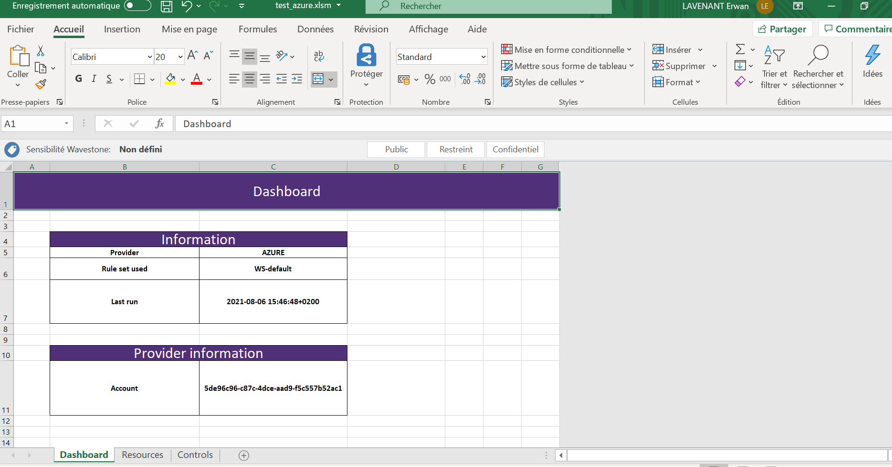
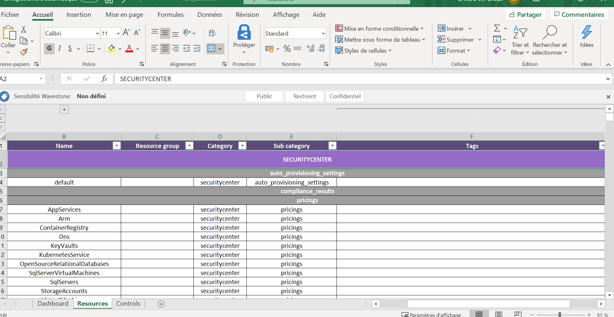
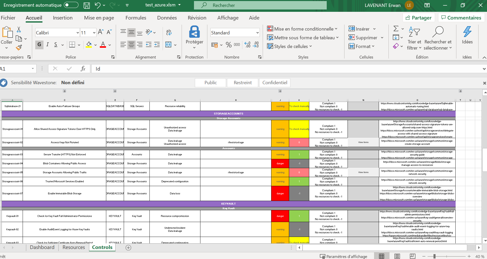

#  Scoutsuite pour Wavestone 

## Introduction

Cette documentation décrit les fonctionnalités supplémentaires rajoutées afin d'améliorer les capacités de l'outil ScoutSuite dans le cadre de missions clients.
Vous trouverez dans ce document:
- La liste des fonctionnalités rajoutées
- Une aide sur l'usage de ces nouvelles fonctionnalités
- Des informations supplémentaires afin que le travail réalisé puisse être complété si besoin

## Sommaire

1) Nouvel usage de ScoutSuite - démarche
2) Export sous format Excel
3) Rajout de règles - guide

## 1. Nouvel usage de ScoutSuite - démarche

De nombreuses règles de conformité ont été rajoutées à l'outil. Afin de les utiliser
lors d'un audit Azure ou Aws il est donc nécessaire d'utiliser les nouveaux ruleset Wavestone
spécialement crées pour l'occasion.  
Ces rulesets sont accessibles dans les dossiers respectifs des providers sous les noms 
"WS-default.json", une commande type afin de lancer ScoutSuite avec ces ruleset est donc par exemple: 
<code>python scout.py azure --cli --ruleset WS-default.json </code>   

*il est possible de spécifier des services spécifiques avec le flag --services [services]*

Une fois la commande effectuée les données brutes sont disponibles dans le fichier .js indiqué 
et un rapport html permettant la visualisation des règles et ressources est généré

En plus de ce rapport, cette version de ScoutSuite permet la génération de livrables Excel permettant d'aider
l'auditeur à la revue de règles de conformité mais également d'être fourni presque tel quel au client.  
Pour générer ce rapport Excel, une commande type est :

<code> python scout.py aws --excel -i [fichier .js source] -o [fichier .xslm de destination]
</code>

*Pour plus d'informations sur le livrable Excel généré se référer à la section suivante.*

Depuis le fichier Excel généré l'auditeur peut effectuer les tests non automatisés grâce 
aux nombreuses informations présentes dans l'excel en s'aidant :
- soit du rapport html pour visualiser les composants 
- soit de la console du fournisseur cloud concerné et des références cloud conformity présentes
dans le livrable si besoin
  
Une fois le livrable vérifié et complété, il peut être fourni au client.

## 2. Export Excel

Usage : 
<code> python scout.py aws --excel -i [fichier .js source] -o [fichier .xslm de destination]
</code>

La fonctionnalité permet  la génération de livrables Excel permettant d'aider
l'auditeur à la revue de règles de conformité mais également d'être fourni presque tel quel au client.

La commande fonctionne pour Azure ou AWS et supporte la sélection de services particuliers avec le flag
<code> --services [services] </code>

Le rapport excel généré possède 3 onglets :

1. Dashboard

Cet onglet fourni des informations générales sur scan effectué 

2. Resources

Les différentes ressources de l'environnement cloud (supportées par l'outil) triées par 
catégorie et sous catégorie. Des tris filtres sur le champs "tags" sont possibles

3. Controls

Les différents contrôles à effectuer lors d'un audit. Les différentes colonnes sont :

- **Id**: identifiant du contrôle
- **Description**: une description brêve de la règle
- **Rationale** (caché): une description avancée de la règle
- **Category**: la catégorie du contrôle (groupe de ressource concerné)
- **Sub category**: la sous-catégorie du contrôle 
- **Risk associated**: le risque associé à la non conformité 
- **Items**: une liste des ressources concernées (si existantes)
- **Item list**: liste des ressources concernées sous format liste python
- **Level**: la criticité de la règle
- **Compliance**: 0, 1 ou -1, indiquant si l'environnement est conforme à la règle
- **Scoring scale**: échelle associée au score de compliance
- **Macro filter button**: bouton permettant de filtrer l'onglet ressources pour n'afficher que les ressources impactées
- **References**: les références liées à la règle
- **Remediation**: informations sur la remédiation de la règle. La mention "Quick win" représente une règle rapide à mettre en place
- **Checked items**: le nombre de ressources checkées
- **Flagged items**: le nombre de ressources non conformes à la règle
- **Path**: le chemin des ressources lmiées à la règle dans l'arborescence des données brutes du fichier .js

>Il est à noter qu'il est possible de générer un rapport Excel pour un seul service. Dans ce cas la,
des onglets supplémentaires seront générés par ressource et contiennent toutes les données brutes.
un développement particulier exemple a été effectué pour le service iam de aws.

### Informations techniques pour les développeurs ###

les sources liées à la généraion Excel sont disponibles dans les packages :
<code> ScoutSuite.ScoutSuite.output.export_scripts </code>
<code> ScoutSuite.ScoutSuite.output.dashboard_scripts </code>

la génération des rapports excel s'appuie sur un moteur de conversion json vers Excel. 
le fichier est donc généré depuis un dictionnaire chargé en mémoire suivant un format précis. 

- *dict*
    - **sheet_list** *list* : liste des onglets 
    - **sheet_data** *dict* : données associées aux onglets
        - **header_list** *list* : liste des noms de colonne de l'onglet
        - **cell_format** *dict* : le format des colonnes 
            - **header_style** *dict* : format du header (voir code)
            - **data_style** *dict* : format des données (voir code)
            - **conditional_format** *dict*: format conditionnel (voir code)
            - **collapsed** *dict*: colonnes devant être cachées (voir code)
        - **data** *dict*: association key=colonne/value=données
    
Pour la définition des macros, voir directement le code commenté. 

# 3. rajout de règles - guide

Pour rajouter des règles, il est nécessaire de d'abord bien comprendre le fonctionnement de ScoutSuite
et pour cela j'en réfère au [wiki](https://github.com/nccgroup/ScoutSuite/wiki/NCC-Scout).

Une fois le fonctionnement compris il faut bien noter la différence entre le ruleset Wavestone et celui natif de ScoutSuite,
celui de Wavestone était bien plus complet tant par les règles rajoutées que par les informations qu'il contient. 

En effet, il a été rajouté dans le ruleset:
- un 3ème niveau de criticité, "low"
- le flag "automated" indiquant si la règle est automatisée ou non

De nombreux champs ont également été rajoutés dans les définitions des règles elles même.

> Pour rajouter une règle il est possible de s'appuyer sur le site de cloud conformity qui donne de nombreuses informations
> et disponible ici : https://www.cloudconformity.com/knowledge-base/

